# IOT Stream Data Mining

GALLITELLI Davide - A.Y. 2017/18 @ TELECOM ParisTech

## Goal

These are some notes for the course **IOT Steam Data Mining**, held by prof. BIFET Albert, at TELECOM ParisTech during the second period of the first semester of the 2017/18 academic year.

Ideally, these would comprehend everything explained during the course, as well as some further insight into some of the topics.

Everything in here is based on my understanding of the topic, therefore some things may be explained quickly or not in depth enough.

Enjoy.

*****

## Introduction

In the Big Data world, data is becoming increasingly *huge* and *fast*. This trend will not decrease, but it will become even stronger, considering how IOT devices are becoming mainstream.

Traditional discovery methods of KDDs are based on **batches**: data is read from the input, it's held in memory and a model is built from the memory itself. These methods work pretty well with non-huge datasets, since memory is a constraint even for the biggest of the clusters. IOT devices will flood data centers with new inputs generated continuously and from many different sources. This calls for a new method of handling knowledge discovery.

**Stream mining** proposes a new approach to knowledge discovery, an **incremental** one base on **instances**. Basically, examples are read as soon as they arrive, *one instance at a time, and at most once* and learning is applied to this instance by *updating* the existing model. An instance processes one example at a time, therefore requiring only a *limited amount of memory* and a *limited amount of time*. Furthermore, this new KDD should enable *anytime prediction**, which means that at any time during the learning process I should be able to obtain predictions from the model.


As stated before, due to the speed at which new instances arrive, these examples should be read and analyzed fast, which means never more than once. This implies that we are looking for an **approximation** of the solution, meaning that we want, with high probability (1-*delta*) a small error *epsilon* with respect to the classic batch solution which would require too much time to compute (due to multiple passes over the data). Most of the algorithms have parameters that can be fine tuned so that a certain degree of confidence can be enforced, at the expenses of computation time.

In a nutshell, **stream data mining** comprehends:
- potentially unbounded data (streams can be infinite)
- very fast incoming stream (requiring *at-most-once* read)
- time and memory constrained learning models (should be fast in learning and always reside in main memory)
- anytime prediction (always available model)

Some *application* examples:
- IOT sensor analysis and prediction
- Market/Stock real-time analytics
- Real-time social network mining for sentiment analysis
- Time series prediction

## **Data Stream Algorithms**

In order to allow this *probabilistic* approach to knowledge discovery, some new algorithms are required. Those should guarantee, with a tunable parameter of confidence, certain performances in terms of errors. In general, we are looking for small error rate with high probability, which means mathematically that:
> 

### 8-bit counting: the Morris Approximate Counting Algorithm

The very first time something close to the idea behind *Data Stream Algorithm* has been talked about dates back to 1978 with a paper from Robert Morris named "*Counting Large Numbers of Events in Small Registers*".


The main idea behind it was that, given a 8-bit register, we want to store the highest possible number of numbers, or *events*. With the normal binary system applied to the standard decimal counting, we can store up to *2^8 -1* numbers, or 255 numbers.

If we used instead a logarithmic scale, then the number of events that can be stored in 8 bits would greatly increase:


In order to implement such strategy, Morris came up with the *approximate counting algorithm*:

```
1. Init counter c <- 0
2. for every event in the stream
3. 		do rand = random number between 0 and 1
4. 			if rand < p
5. 				then c <- c + 1
```

where *p* is a parameter of the algorithm.

Basically, the algorithm tries increases the counter with a probability *p*:
- If `p = 2^(-1) = 1/2`, we can store up to `2 x 256` values, with standard deviation `sigma = sqrt(n)/2`.
- If `p = 2^(-c)`, the error of the approximation is `E[2^c] = n+2` with variance `sigma^2 = n(n+1)/2`
- Given a number `b`, if `p = b^(-c)`, then `E[b^c] = n(b-1)+b` with variance `sigma^2 = (b-1)n(n+1)/2`.

### Count-Distinct algorithm: Flajolet-Martin Probabilistic Counting


The **Flajolet–Martin algorithm** is an algorithm for approximating the *number of distinct elements* in a stream with a single pass, exploiting the logarithmic representation seen before. The algorithm was introduced by Philippe Flajolet and G. Nigel Martin in their 1984 article "*Probabilistic Counting Algorithms for Data Base Applications*".

By definition of the problem, we can infer that:
> if the stream contains *n* elements with *m* of them being unique, then the algorithm runs in *O(n)* time and need *O(log(m))* memory.

Given the pseudo-code above, the algorithm is based on a hash function *h(x)* to represent the incoming example. Such hash function maps the example *x* to integers in the range `[0;2*L -1]`, with the outputs being sufficiently uniformly distributed. Then, the *position of the least significant 1-bit* (or, the left-most [\*] bit set to 1) is used to update a bitmap representing the "buckets" of the hash function (which has length `L` and initially contains all `0s`). Finally, the position *b* of the left-most zero in the bitmap is considered. Because it can be stated that, with logarithmic distribution:

> 

> [EN] for me, how this error computation is made is magic. Any help is welcome.

then we return the approximate value given *b* index of the bitmap. Worst case scenario, the error is +-1.12 .

[\*] : everybody knows that the least significant bit should be counted starting from the right. In this example, it was not such a case, bear with it. The concept does not change, only the position in the bitmap would change.

##### Example:

|item x|hash(x)|p(hash(x))|bitmap|
|------|-------|----------|------|
|||||

Let's start with an empty table. The first example incoming is *a*, which is magically-hashed to *0110*. It does not matter how the hashing function generates the binary string, as any can be used.

|item x|hash(x)|p(hash(x))|bitmap|
|------|-------|----------|------|
|a|0110|||

`p(hash(x))` computes the position of the left-most bit set to 1, therefore in this case `p(hash(x)) = 1`. Then, `bitmap[p(hash(x))]` is updated (considering the left-most bit as `bitmap[0]`).

|item x|hash(x)|p(hash(x))|bitmap|
|------|-------|----------|------|
|a|0110|1|0100|

Following the same idea, further examples are handled like this:

|item x|hash(x)|p(hash(x))|bitmap|
|------|-------|----------|------|
|a|0110|1|0100|
|b|1001|0|1100|
|c|0111|1|1100|
|a|0110|1|1100|
|b|1001|0|1100|
|d|1100|0|1100|
|**e**|**0001**|**3**|**1101**|
|f|1010|0|1101|

> [EN] the record in bold chars has been changed from the slides example, to show a third bit switch

With this, we can compute *at any time* the count of unique elements in the stream. Since the left-most bit set to 0 in the bitmap `b = 2`, our estimation of unique numbers `n = (2^b)/0.77351 = 5.17`. The true `n` is 6, but it is still a good approximation.

##### Example 2:

If we had a situation like this:
|item x|hash(x)|p(hash(x))|bitmap|
|------|-------|----------|------|
|a|0110|1|0100|
|a|0110|1|0100|
|a|0110|1|0100|
|e|0001|3|0101|

Then we would obtain:
- `b = 0`
- `n = 2^0 / 0.77351 = 1.29`

##### A modified FM Algorithm

A modified version of the same algorithm used the *max* function instead of a bitmap.


### Count-Distinct: HyperLogLog

The FM algorithm explained above has been refined in "*LogLog counting of large cardinalities*" and "*HyperLogLog: The analysis of a near-optimal cardinality estimation algorithm*".

In this algorithm, the stream is divided in `m = 2^b` substreams, and the estimation uses *harmonic mean*[\*]. This way, the **realtive accuracy** is greater than the *stochastic averaging*[\*\*], and it's equal to `1.04 / sqrt(m)`.


[\*] **Harmonic Mean**: it's one of different kinds of averages, typically used when the average of *rates* is desired. It's the reciprocal of the **arithmetic mean** of the reciprocals of a given set, therefore: `Hm = len(X) / sum(1 / x_i)` where X is the array of examples

[\*\*] **Stochastic Averaging**: when performing `m` experiments in parallel, the standard deviation can be averaged as `st_dev' = st_dev/sqrt(m)`, with relative accuracy of `0.78/sqrt(m)`.

### Frequent Itemset Mining: MAJORITY Algorithm
In the *frequent itemset mining* problem, we are looking to build a dataset of frequent itemset while reading a stream. There are different algorithms to do so.

```
[MAJORITY]
1 Init counter c <- 0
2 for every item s in the stream
3	if counter is zero
4 		then pick up the item
5 	if item is the same
6 		then increment counter
7 	else decrement counter
```

The easiest of them is the **Majority** algorithm, which increments a counter related to the item read from the stream.

### Frequent Itemset Mining: FREQUENT Algorithm

```
[FREQUENT]
1 for every item i in the stream
2 	if item i is not monitored
3 		if < k items monitored
4 			then add a new item with count 1
5 		else if an item z whose count is zero exists
6 			then replace this item z by the new one
7 		else decrement all counters by one
8 	else item i is monitored
9 		increase its counter by one
```

A different version instead is the **Frequent** algorithm, which only keeps monitoring the `k`-most frequent elements. Whenever an example is read from the stream, its counter is updated if it's not new, otherwise, the list of monitored items is updated as specified in the snippet above.

<!-- Example? -->

### Frequent Itemset Mining: LOSSYCOUNTING Algorithm

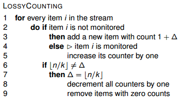

##### The Class Version

The **LossyCounting** algorithm is based on the concept of periodically removing items with low frequency from the list of monitored items. Every time a new item is read, its counter gets updated

- by 1 if it's an already monitored item
- by 1 + *delta* , where *0 < delta < floor(n/k)*, if it's a new item

Once the update is done, then the counters are all decremented by one, and the elements with frequency equal to zero are removed.

##### The Paper/Internet Version

The main concept is still the same, but the idea is to divide the stream into *windows* ([EN] maybe n/k?). Every time a new window is read, the counter for the item is updated by the frequency in the window. Once the full window is read, then all counters are decremented by one. The algorithm is then iterated until the end of the stream.

The new algorithm would more or less look like so:

```
[CUSTOM LOSSYCOUNTING]
1 	define window size W
2	define window counter C
3 	for every item i in the stream S
4 		increase counter of item i by 1 (or add new item with count 1)
5		increase C by 1
6		if C = W
7			decrement all counters by 1
8			remove items with 0 count
9 			reset C to 0
```

The actual count of each item depend on the window size. Still, it is possible to find the same frequent itemset; if `stream-size = N` and `window-size = W = 1/e`, then the **frequency error** is `f_e = eN`.

##### Example:

Let's apply the LOSSYCOUNTING algorithm to the following stream:

|a|b|c|d|a|c|a|a|a|c|d|c|a|a|c|b|
|-|-|-|-|-|-|-|-|-|-|-|-|-|-|-|-|

`STEP 0`

Let's define a window size `W = 4` (since we have 16 elements, this way the example is easier). At the beginning, the window counter is `C = 0`.

`STEP 1`

The first window to be analyzed is:

|a|b|c|d|
|-|-|-|-|

All of them are new items, therefore the *frequent itemset list* becomes, before decrementing it:

|a|b|c|d|
|-|-|-|-|
|1|1|1|1|

Since we reached window boundary, all counters are decremented by one:

|a|b|c|d|
|-|-|-|-|
|0|0|0|0|

All items are dropped from the list.

`STEP 2`

|a|c|a|a|
|-|-|-|-|

The itemset list becomes:

|a|c|
|-|-|
|3|1|

After the update:

|a|
|-|
|2|

`STEP 3`

|a|c|d|c|
|-|-|-|-|

The itemset list becomes:

|a|c|d|
|-|-|-|
|3|2|1|

After the update:

|a|c|
|-|-|
|3|2|

`STEP 4`

|a|a|c|b|
|-|-|-|-|

The itemset list becomes:

|a|c|b|
|-|-|-|
|5|3|1|

After the update:

|a|c|
|-|-|
|4|2|

For this example, we have `stream-size = N = 16` and `window-size = W = 4 = 1/e --> e = 1/4 = 0.25`, the `frequency error = f_e = 16*0.25 = 4`.

##### Example 2:

What if, with the same stream, we changed to window size to something like *8*?

|a|b|c|d|a|c|a|a|a|c|d|c|a|a|c|b|
|-|-|-|-|-|-|-|-|-|-|-|-|-|-|-|-|

`STEP 0`

Let's define a window size `W = 8`. At the beginning, the window counter is `C = 0`.

`STEP 1`

|a|b|c|d|a|c|a|a|
|-|-|-|-|-|-|-|-|

The itemset list becomes:

|a|b|c|d|
|-|-|-|-|
|4|1|2|1|

After the update:

|a|c|
|-|-|
|3|1|

`STEP 2`

|a|c|d|c|a|a|c|b|
|-|-|-|-|-|-|-|-|

The itemset list becomes:

|a|c|d|b|
|-|-|-|-|
|6|4|1|1|

After the update:

|a|c|
|-|-|
|5|3|

For this example, we have `stream-size = N = 16` and `window-size = W = 8 = 1/e --> e = 1/8 = 0.125`, the `frequency error = f_e = 16*0.125 = 2`.

### Frequent Itemset Mining: SPACE SAVING Algorithm

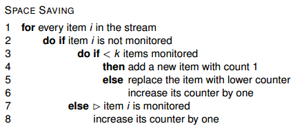

**Space Saving** can be considered as a merge of *LossyCounting* and *Frequent* algorithms. Instead of dropping low count items, just like in the *LossyCounting* algorithm, the **Space Saving** algorithm replaces the item with the lowest counter with the just found not monitored item, and then increments its counter by 1.

##### Example:

Let's suppose that we have an itemset count as such:

|a|b|c|
|-|-|-|
|7|5|3|

then, we read input `d`. The itemset list has reached maximum capacity (set before starting). What happens? The `d` input replaces the item with the lowest count, which is `c`. The itemset list becomes:

|a|b|d|
|-|-|-|
|7|5|4|

### Frequent Itemset Mining: COUNT-MIN SKETCH Algorithm

The counter algorithms analyzed until now only handle the “*arrivals only*” model, not the “**arrivals and departures**” one. This means that, if there is a case of "negative frequency", the previous algorithms do not have a deterministic solution. Sketch algorithms compute a summary that is a linear transform of the frequency vector.

The **COUNT-MIN** algorithm is one of such algorithms. It uses a two-dimensional array with width `w = ceil(e/epsilon)` and depth `d = ceil(ln(1/delta))`, where both *epsilon* and *delta* are user-given parameters which tune the performances of the algorithm, since the depth represents also the **update time** of the algorithm (the time it takes to read the column/array of values). NB: `e` in the width formula is the Euler's number `e = 2.718281`.

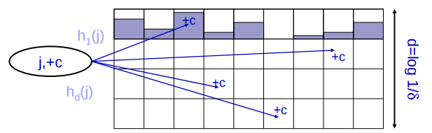

In a nutshell, CM-Sketch computes frequency data adding and removing real values. Every time it reads an input `(j,+c)`, where `c` is a real value, for each row `i` of the table, apply the corresponding *hash function* `h_i` to obtain a column index `k = h_i(j)`. Then increment the value in `j,k` (with `j = [1...d]` and `k = [1...w]`) by `+c`. In order to compute the frequency `f` then, it is as simple as computing the minimum of those updated values, which means `f = min[i,h_i(j)]`.

Given the *epsilon* parameter, it is guaranteed that this algorithm provides a frequency `f <= f_r + epsilon*N`, where `f_r` is the real frequency and `N` is the stream size.

### Reservoir Sampling

Finally, given a data stream `X`, we want to choose `k` items with the same probability,
storing only `k` elements in memory.

```
[RESERVOIR SAMPLING]
1 	for every item i in the first k items of the stream
2 		store item i in the reservoir
3 	n <- k
4 	for every item i in the stream after the first k items of the stream
5 		select a random number r between 1 and n
6 		if r < k
7 			then replace item r in the reservoir with item i
8 		n = n + 1
```

### The problem of MEAN and VARIANCE

Given a data stream X, computing statistics such as **mean** or **variance** loses part of the meaning: these computations have to be done on a *sliding window* of `n` element, since mean and variance are based on the division operator and therefore is not cumulative.


We can maintain simple statistics over sliding windows, using `O(1/epsilon * log^2(N))` space, where:
- `N` is the length of the sliding window
- `epsilon` is the accuracy parameter

### Exponential Histograms

Exploiting the logarithmic compression of values is very useful when storing a window into memory. This is done by partitioning the content of the data stream sliding window into buckets of **exponentially-growing size**. This means that the size of the buckets follows a `2^n` pattern, with `n` starting as `0`. The number of buckets of the same size is controlled by a parameter `M`. In order to give answers in `O(1)` time, three counters are kept: `LAST`, `TOTAL` and `VARIANCE`.

Given a window of `W` elements, and `e` maximum error (user-controllable parameter), then:

- the parameter  `M` is obtained as `M = 1/(2e)`
- the total number of buckets is `M*log(W/M)`

##### Example: how buckets are generated

Let's consider this stream W:

|1110001010101|
|-|

Suppose that the first bit to have arrived is the left-most bit of the given stream. The maximum error is `e=1/6=0.1667`. How is this window stored in memory? What happens when a new `1` bit arrives?

If `e=1/6`, then `M=3`, meaning that we can at most 3 buckets of the same size. In order to see the buckets, let's start unraveling the stream.

The first `1` arrives. It is put in its own bucket. Then other two `1`s arrive, each is put in its own bucket.

|1|1|1|0001010101|
|-|-|-|-|

Then, a `0` arrives. There can't be another bucket with size 1, therefore we need to compress the buckets with size 1, starting from the left-most one. It becomes:

|11|1|0|001010101|
|-|-|-|-|

One more iteration:

|11|1|0|0|01010101|
|-|-|-|-|-|

With the next `1`, we have the same problem as before: we compress.

|11|10|0|0|1010101|
|-|-|-|-|-|

In three iterations, we will have the following situation:

|11|10|00|1|0|1|0101|
|--|--|--|-|-|-|----|

With the new `0` incoming, just like before we would need to compress two buckets of 1 size into a 2-sized bucket. But we reached the M threshold for them too, therefore two two-sized buckets (the left-most ones) will be compressed to a 4-sized bucket.

|11|10|00|10|1|0|101|
|--|--|--|--|-|-|---|

|1110|00|10|1|0|101|
|----|--|--|-|-|---|

With the next three iterations, we would obtain:

|1110|00|10|1|0|1|01|
|----|--|--|-|-|-|--|

|1110|00|10|10|1|0|1|
|----|--|--|--|-|-|-|

What if another `1` arrives?

|1110|00|10|10|1|0|1|1|
|----|--|--|--|-|-|-|-|

|1110|0010|10|10|1|1|
|----|----|--|--|-|-|


******

## **Concept Drift**

In the domain of stream analytics, sometimes the data and its properties change in unforeseen ways, making the predictions given by the previously built model less accurate. Therefore, there is a need for **incremental learning**, which implies either *updating the model* once the change has been detected (left schema on the following image), or *using a more complex algorithm*, possibly made of multiple estimators (right schema on the following image).

<div style="text-align:center">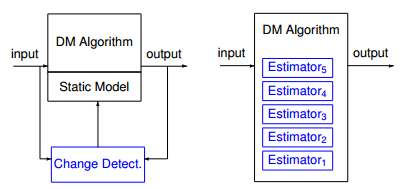</div>

Let's consider a standard learning algorithm, with only one estimator. Our goal is to include a way to **detect a distribution change** by means of some kind of *alarm*, as well as a way to generate a new prediction which **minimizes the prediction error**. This situation can be represented by the following schema of a concept-drift-handling algorithm.

<div style="text-align:center">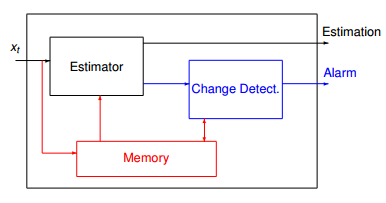</div>

Change detection is a tricky business. There may be cases in which false alarms are launched, and those may be caused by *noise* in the data or short-time changes in the distribution. Once could say that the design of a change detector is a *compromise* between *detecting true changes* and *avoiding false alarms*.

Some **metrics** can be defined to *evaluate* concept drift:

- Mean Time between False Alarms (MTFA)
- Mean Time to Detection (MTD)
- Missed Detection Rate (MDR)
- Average Run Length (ARL(θ))

Ideally, an optimal change detector and predictor system should have:

- High accuracy in the prediction
- Low mean time to detection (MTD), false positive rate (FAR) and missed detection rate (MDR)
- Low computational cost: minimum space and time needed
- Theoretical guarantees
- No parameters needed

#### Detecting concept drift: the CUSUM Test

The cumulative sum (CUSUM algorithm), gives an alarm when the mean of the input data is significantly different from zero. It's a memoryless test, and its accuracy depends
on the choice of parameters υ and h. Mreover, it doesn't handle negative values for the instance read.

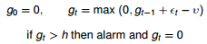

#### Detecting concept drift: the Page Hinckley Test

Unlike the CUSUM algorithm, it is possible to have *negative values*.

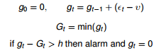

#### Detecting concept drift: the Geometric Moving Average Test

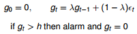

The forgetting factor λ is used to give more or less weight to the last data arrived. The greater the λ, the greater the weight of the most recent value. The treshold h is used to tune the sensitivity and false alarm rate of the detector.

#### Detecting concept drift: the Statistical Test

> Note to the reader: this part is taken from the MOA book: ["Data Stream Mining: A Practical Approach"](https://goo.gl/HX4j8L). I found most of it pretty easy to understand, therefore I copy-pasted it the first chunk of it.

CUSUM and GMA are methods for dealing with numeric sequences. For more
complex populations, we need to use other methods. There exist some statistical
tests that may be used to detect change. A statistical test is a procedure for
deciding whether a hypothesis about a quantitative feature of a population is
true or false. We test an hypothesis of this sort by drawing a random sample
from the population in question and calculating an appropriate statistic on its
items. If, in doing so, we obtain a value of the statistic that would occur rarely
when the hypothesis is true, we would have reason to reject the hypothesis.

Given two sources of data, `x_0` and `x_1`, we want to test the hypothesis `H_0`, e.g. that the two sources come from the same distribution. To do so, we need two statistical properties, such as two estimates, `µ_0` and `µ_1`, and the variances `σ_0 ^2` and `σ_1 ^2`. If there is no
change in the data, these estimates will be consistent. Otherwise, a hypothesis test will reject H0 and a change is detected. An easy way to test this consistence is to compute the difference of the estimates:
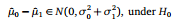 or with the `χ^2` test:
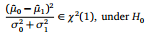

<div style="text-align:center">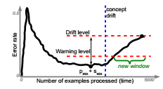</div>

##### Example:

For example, suppose we want to design a change detector using a statistical
test with a probability of false alarm of 5%, that is: 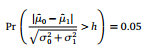

Since, with Gaussian Distribution, `P(X < 1.96) = 0.975` the test becomes:
test with a probability of false alarm of 5%, that is: 

### Change detection: ADWIN (ADaptive data stream sliding WINdow)

**ADWIN** is a parameter-free adaptive size sliding window, with theoretical guarantees.

> ADWIN is an adaptive sliding window algorithm, whose window size is recomputed online according to the rate of change observed.

It keeps an *adaptive sliding window* which tries to estimate the **mean** of a monitored numeric variable. The window grows while things are stable, while, upon a change of the mean, the window is cut into two parts: an "old" part, which is discarded, and a "new" part, with which now has a new mean.

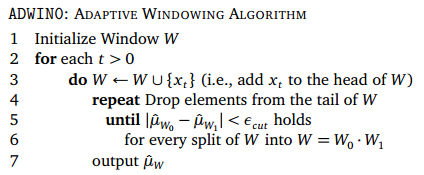

The size of the window is not a problem, since storing of the window is handled by an internal exponential compression scheme, basically *exponential histograms* (see *exponential histograms* example above).

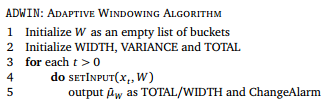
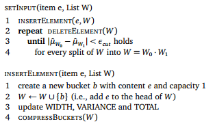
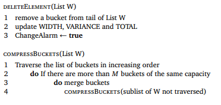

Since ADWIN algorithm uses the *Data Stream Sliding Window Model*:

- It tries `O(log(W))` cutpoints
- It uses `O(M*log(W/M))` memory words (assuming a memory word can contain numbers up to `W`).
- It can process the arrival of a new element in `O(1)` amortized time and `O(log(W))` worst-case time.
- It can provide the exact counts of 1’s in `O(1)` time per point.

It is not a purely heuristical algorithm, because it has theoretical guarantees on the rate of false positives/negatives, as well as on the relation of the window size and change rates.

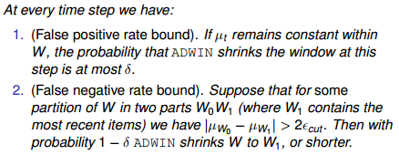

******

## Evaluation

The evaluation procedure of a learning algorithm determines which examples
are used for training the algorithm, and which are used to test the model output
by the algorithm. With the new incremental approach to the learning process, a new definition of accuracy over time is needed, as well as new evaluation frameworks.

### Error Estimation

Two methods exists for error estimation:
- **Hold-out**
	- to be used only if a *testing dataset* is available, it consists of applying an unbiased estimator to the test set at regular time intervals
	- it is generally more accurate
- **Prequential/Interleaved-Test-Then-Train**
	- if there is no testing data available, then this is the go-to method
	- For each example in the stream, the actual model makes a prediction, and then uses it to update the mode - a bootstrap batch learner is needed!
	- it's the cross-validation of the data streams

*****

## Classification

*****

## Ensemble Learning

In machine learning classification, an ensemble of classifiers is a collection of several models combined together, in a form which can be generalized as the following algorithm:

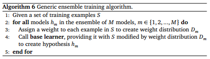

This procedure requires three elements to create an ensemble:
1. A set S of training examples
2. A base learning algorithm
3. A method of assigning weights to examples (line 3 of the pseudo-code)

The third requirement, the weighting of examples, forms the major difference between ensemble methods. Another potential difference is the voting
procedure. Typically each member of the ensemble votes towards the prediction of class labels, where voting is either **weighted** or **unweighted**. In weighted
voting individual classifiers have varying influence on the final combined vote,
the models that are believed to be more accurate will be trusted more than
those that are less accurate on average. In unweighted voting all models have
equal weight, and the final predicted class is the label chosen by the majority of
ensemble members. Ensemble algorithms, algorithms responsible for inducing
an ensemble of models, are sometimes known as **meta-learning** schemes. They
perform a higher level of learning that relies on lower-level base methods to
produce the individual models.

#### Ensemble: Bagging

**Bagging** (*bootstrap aggregating*) combines the unweighted vote of multiple classifiers, each of which is trained on a different *bootstrap replicate* of the training set. A bootstrap replicate is a set of examples drawn randomly with replacement from the original training data, to match the size of the original training data. Bagging builds a set of M base models, with a bootstrap sample created by drawing random samples with replacement.

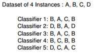

This algorithm does not seem immediately applicable to data streams, because it appears that the entire data set is needed in order to construct bootstrap replicates. However, a modified version for incremental learning has been proposed by Oza and Russell, called **Online Bagging**. They demonstrated that the process of sampling bootstrap replicates from training data follows a *Binomial Distribution*, which tends to a *Poisson(1) distribution* with `N->infinite`. In their algorithm, they use this distribution to decide how many times to include the incoming example in the formation of a replicate set. This *online bagging algorithm* converges towards the original batch algorithm, which required the full dataset to be known.

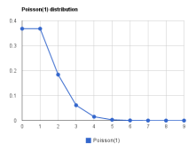


#### Ensemble: Hoeffding Option Trees

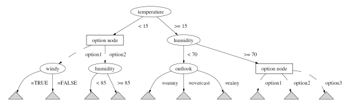

The **Hoeffding option tree** is a regular Hoeffding tree containing additional option nodes that allow several tests to be applied, leading to multiple Hoeffding trees as separate paths. The Hoeffding option tree uses the class confidences in each leaf to help form the majority decision.

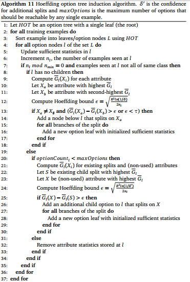

#### Ensemble: Accuracy Weighted Ensemble

The **accuracy weighted ensemble** algorithm consists of processing chunks of instances with size `W` by building a new classifier for each of the chunks (removing the old one). Then, each classifiier is weighted using the difference of *Mean Square Error* 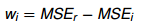 for the newly built model 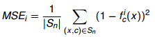 and the current one 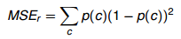

For two classes classification with equal class priors, `MSE_r = 0.25`. Classifiers with accuracy less or equal than random classifier will be assigned weight `0` and the weights of other classifiers will be inversely proportional to their error in classifying calibration data of current user.

#### Ensemble: Random Forests

Random Forests is a method to use randomization on
the input and on the internal construction of the decision trees. Random Forests are ensembles of trees with the following characteristics: the input training set is obtained by sampling with replacement, the nodes of the tree only may use
a fixed number of random attributes to split, and the trees are grown without pruning.

#### Ensemble: ADWIN Bagging

When a change is detected, the worst classifier is removed and a new classifier is added.

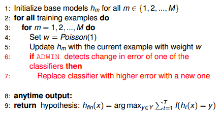

<!-- #### Ensemble: Leveraging Bagging -->
