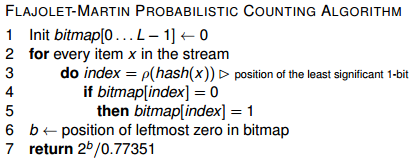
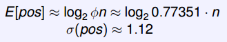
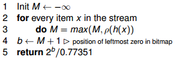
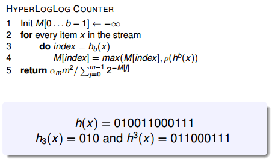

# IOT Stream Data Mining

GALLITELLI Davide - A.Y. 2017/18 @ TELECOM ParisTech

## Goal

These are some notes for the course **IOT Steam Data Mining**, held by prof. BIFET Albert, at TELECOM ParisTech during the second period of the first semester of the 2017/18 academic year.

Ideally, these would comprehend everything explained during the course, as well as some further insight into some of the topics.

Everything in here is based on my understanding of the topic, therefore some things may be explained quickly or not in depth enough.

Enjoy.

## Introduction

In the Big Data world, data is becoming increasingly *huge* and *fast*. This trend will not decrease, but it will become even stronger, considering how IOT devices are becoming mainstream.

Traditional discovery methods of KDDs are based on **batches**: data is read from the input, it's held in memory and a model is built from the memory itself. These methods work pretty well with non-huge datasets, since memory is a constraint even for the biggest of the clusters. IOT devices will flood data centers with new inputs generated continuously and from many different sources. This calls for a new method of handling knowledge discovery.

**Stream mining** proposes a new approach to knowledge discovery, an **incremental** one base on **instances**. Basically, examples are read as soon as they arrive, *one instance at a time, and at most once* and learning is applied to this instance by *updating* the existing model. An instance processes one example at a time, therefore requiring only a *limited amount of memory* and a *limited amount of time*. Furthermore, this new KDD should enable *anytime prediction**, which means that at any time during the learning process I should be able to obtain predictions from the model.


As stated before, due to the speed at which new instances arrive, these examples should be read and analyzed fast, which means never more than once. This implies that we are looking for an **approximation** of the solution, meaning that we want, with high probability (1-*delta*) a small error *epsilon* with respect to the classic batch solution which would require too much time to compute (due to multiple passes over the data). Most of the algorithms have parameters that can be fine tuned so that a certain degree of confidence can be enforced, at the expenses of computation time.

In a nutshell, **stream data mining** comprehends:
- potentially unbounded data (streams can be infinite)
- very fast incoming stream (requiring *at-most-once* read)
- time and memory constrained learning models (should be fast in learning and always reside in main memory)
- anytime prediction (always available model)

Some *application* examples:
- IOT sensor analysis and prediction
- Market/Stock real-time analytics
- Real-time social network mining for sentiment analysis
- Time series prediction

## Data Stream Algorithms

In order to allow this *probabilistic* approach to knowledge discovery, some new algorithms are required. Those should guarantee, with a tunable parameter of confidence, certain performances in terms of errors. In general, we are looking for small error rate with high probability, which means mathematically that:
> 

### 8-bit counting: the Morris Approximate Counting Algorithm

The very first time something close to the idea behind *Data Stream Algorithm* has been talked about dates back to 1978 with a paper from Robert Morris named "*Counting Large Numbers of Events in Small Registers*".


The main idea behind it was that, given a 8-bit register, we want to store the highest possible number of numbers, or *events*. With the normal binary system applied to the standard decimal counting, we can store up to *2^8 -1* numbers, or 255 numbers.

If we used instead a logarithmic scale, then the number of events that can be stored in 8 bits would greatly increase:


In order to implement such strategy, Morris came up with the *approximate counting algorithm*:

```
1. Init counter c <- 0
2. for every event in the stream
3. 		do rand = random number between 0 and 1
4. 			if rand < p
5. 				then c <- c + 1
```

where *p* is a parameter of the algorithm.

Basically, the algorithm tries increases the counter with a probability *p*:
- If `p = 2^(-1) = 1/2`, we can store up to `2 x 256` values, with standard deviation `sigma = sqrt(n)/2`.
- If `p = 2^(-c)`, the error of the approximation is `E[2^c] = n+2` with variance `sigma^2 = n(n+1)/2`
- Given a number `b`, if `p = b^(-c)`, then `E[b^c] = n(b-1)+b` with variance `sigma^2 = (b-1)n(n+1)/2`.

### Count-Distinct algorithm: Flajolet-Martin Probabilistic Counting



The **Flajolet–Martin algorithm** is an algorithm for approximating the *number of distinct elements* in a stream with a single pass, exploiting the logarithmic representation seen before. The algorithm was introduced by Philippe Flajolet and G. Nigel Martin in their 1984 article "*Probabilistic Counting Algorithms for Data Base Applications*".

By definition of the problem, we can infer that:
> if the stream contains *n* elements with *m* of them being unique, then the algorithm runs in *O(n)* time and need *O(log(m))* memory.

Given the pseudo-code above, the algorithm is based on a hash function *h(x)* to represent the incoming example. Such hash function maps the example *x* to integers in the range `[0;2*L -1]`, with the outputs being sufficiently uniformly distributed. Then, the *position of the least significant 1-bit* (or, the left-most [\*] bit set to 1) is used to update a bitmap representing the "buckets" of the hash function (which has length `L` and initially contains all `0s`). Finally, the position *b* of the left-most zero in the bitmap is considered. Because it can be stated that, with logarithmic distribution:

> 

> [EN] for me, how this error computation is made is magic. Any help is welcome.

then we return the approximate value given *b* index of the bitmap. Worst case scenario, the error is +-1.12 .

[\*] : everybody knows that the least significant bit should be counted starting from the right. In this example, it was not such a case, bear with it. The concept does not change, only the position in the bitmap would change.

##### Example:

|item x|hash(x)|p(hash(x))|bitmap|
|------|-------|----------|------|
|||||

Let's start with an empty table. The first example incoming is *a*, which is magically-hashed to *0110*. It does not matter how the hashing function generates the binary string, as any can be used.

|item x|hash(x)|p(hash(x))|bitmap|
|------|-------|----------|------|
|a|0110|||

`p(hash(x))` computes the position of the left-most bit set to 1, therefore in this case `p(hash(x)) = 1`. Then, `bitmap[p(hash(x))]` is updated (considering the left-most bit as `bitmap[0]`).

|item x|hash(x)|p(hash(x))|bitmap|
|------|-------|----------|------|
|a|0110|1|0100|

Following the same idea, further examples are handled like this:

|item x|hash(x)|p(hash(x))|bitmap|
|------|-------|----------|------|
|a|0110|1|0100|
|b|1001|0|1100|
|c|0111|1|1100|
|a|0110|1|1100|
|b|1001|0|1100|
|d|1100|0|1100|
|**e**|**0001**|**3**|**1101**|
|f|1010|0|1101|

> [EN] the record in bold chars has been changed from the slides example, to show a third bit switch

With this, we can compute *at any time* the count of unique elements in the stream. Since the left-most bit set to 0 in the bitmap `b = 2`, our estimation of unique numbers `n = (2^b)/0.77351 = 5.17`. The true `n` is 6, but it is still a good approximation.

##### Example 2:

If we had a situation like this:
|item x|hash(x)|p(hash(x))|bitmap|
|------|-------|----------|------|
|a|0110|1|0100|
|a|0110|1|0100|
|a|0110|1|0100|
|e|0001|3|0101|

Then we would obtain:
- `b = 0`
- `n = 2^0 / 0.77351 = 1.29`

##### A modified FM Algorithm

A modified version of the same algorithm used the *max* function instead of a bitmap.



### Count-Distinct: HyperLogLog

The FM algorithm explained above has been refined in "*LogLog counting of large cardinalities*" and "*HyperLogLog: The analysis of a near-optimal cardinality estimation algorithm*".

In this algorithm, the stream is divided in `m = 2^b` substreams, and the estimation uses *harmonic mean*[\*]. This way, the **realtive accuracy** is greater than the *stochastic averaging*[\*\*], and it's equal to `1.04 / sqrt(m)`.



[\*] **Harmonic Mean**: it's one of different kinds of averages, typically used when the average of *rates* is desired. It's the reciprocal of the **arithmetic mean** of the reciprocals of a given set, therefore: `Hm = len(X) / sum(1 / x_i)` where X is the array of examples

[\*\*] **Stochastic Averaging**: when performing `m` experiments in parallel, the standard deviation can be averaged as `st_dev' = st_dev/sqrt(m)`, with relative accuracy of `0.78/sqrt(m)`.
